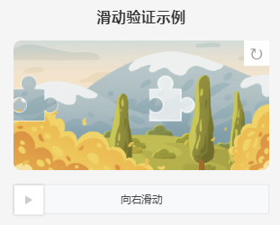

# 支付宝小程序 - 滑动验证组件

基于 [vue-monoplasty-slide-verify](https://github.com/monoplasty/vue-monoplasty-slide-verify) 改写的支付宝小程序自定义组件。

## 效果演示

用户向右滑动滑块，将拼图块对准缺口位置即可完成验证。组件内置人机检测，可识别非人为操作（如脚本自动滑动）。



## 目录结构

```
alipay-slide-verify/
├── app.json                    # 小程序配置
├── app.js                      # 小程序入口
├── app.acss                    # 全局样式
├── components/
│   └── slide-verify/
│       ├── index.json          # 组件配置
│       ├── index.axml          # 组件模板
│       ├── index.acss          # 组件样式
│       └── index.js            # 组件逻辑
├── pages/
│   └── index/
│       ├── index.json          # 页面配置（注册组件）
│       ├── index.axml          # 页面模板
│       ├── index.acss          # 页面样式
│       └── index.js            # 页面逻辑
└── README.md
```

## 直接运行

本项目是一个完整的支付宝小程序工程，可直接用支付宝开发者工具（IDE）打开 `alipay-slide-verify/` 目录运行。
如需使用微信小程序，可以按wx:相应语法修改。

1. 打开 [支付宝开发者工具](https://opendocs.alipay.com/mini/ide/download)
2. 选择「打开项目」→ 选择 `alipay-slide-verify/` 目录
3. 填入 AppID（或使用测试号）
4. 即可在模拟器中预览滑动验证效果

## 快速开始

### 1. 引入组件

将 `components/slide-verify/` 目录复制到你的支付宝小程序项目中。
忽略 `components/slide-verify-base/` CSS基础版，不过兼容性更好，以防备用。

在页面的 `index.json` 中注册组件：

```json
{
  "usingComponents": {
    "slide-verify": "/components/slide-verify/index"
  }
}
```

### 2. 使用组件

**index.axml:**

```xml
<slide-verify
  id="slideVerify"
  w="{{310}}"
  h="{{155}}"
  sliderText="向右滑动"
  accuracy="{{5}}"
  show="{{true}}"
  imgs="{{imgs}}"
  onSuccess="onSuccess"
  onFail="onFail"
  onRefresh="onRefresh"
  onAgain="onAgain"
  onFulfilled="onFulfilled"
></slide-verify>

<view>{{msg}}</view>
```

**index.js:**

```js
Page({
  data: {
    msg: '',
    imgs: []
  },

  onSuccess(e) {
    const times = e.detail.timestamp;
    console.log('验证通过，耗时 ' + times + ' 毫秒');
    this.setData({ msg: '验证通过，耗时 ' + (times / 1000).toFixed(1) + 's' });
  },

  onFail() {
    console.log('验证不通过');
    this.setData({ msg: '' });
  },

  onRefresh() {
    console.log('点击了刷新图标');
    this.setData({ msg: '' });
  },

  onFulfilled() {
    console.log('刷新成功');
  },

  onAgain() {
    console.log('检测到非人为操作');
    this.setData({ msg: '检测到非人为操作，请重试' });
    // 自动刷新
    this.selectComponent('#slideVerify').reset();
  }
});
```

## 组件属性 (Props)

| 属性 | 类型 | 默认值 | 说明 |
| :--- | :--- | :--- | :--- |
| l | Number | 42 | 拼图块边长 |
| r | Number | 10 | 拼图块凸起圆角半径 |
| w | Number | 310 | 画布宽度 (px) |
| h | Number | 155 | 画布高度 (px) |
| sliderText | String | '向右滑动' | 滑动条提示文字 |
| accuracy | Number | 5 | 验证精度（误差范围 1-10），-1 表示关闭人机检测 |
| show | Boolean | true | 是否显示刷新按钮 |
| imgs | Array | [] | 自定义背景图数组（网络图片URL），为空时使用默认图片 |

## 组件事件 (Events)

| 事件 | 参数 | 说明 |
| :--- | :--- | :--- |
| onSuccess | e.detail.timestamp (Number) | 验证通过，timestamp 为滑动耗时（毫秒） |
| onFail | - | 验证失败（滑块位置不匹配） |
| onRefresh | - | 点击刷新按钮时触发 |
| onAgain | - | 检测到非人为操作时触发 |
| onFulfilled | - | 刷新完成时触发 |

## 组件方法 (Methods)

父组件通过 `this.selectComponent('#id')` 获取组件实例后调用：

### reset()

重置组件状态，重新生成拼图位置和背景图。

```js
const slideVerify = this.selectComponent('#slideVerify');
slideVerify.reset();
```

## 人机检测原理

组件记录了用户滑动过程中的 Y 轴移动轨迹，通过计算轨迹数据的**平均值**和**标准差**来判断是否为人为操作：

- 人为操作：手指在水平滑动时会有自然的上下抖动，平均值 ≠ 标准差
- 机器操作：匀速直线运动，平均值 = 标准差

`accuracy` 参数控制误差范围（1-10），值越小精度要求越高。设置为 `-1` 可关闭人机检测。

## 与 Vue 版本的主要差异

| 特性 | Vue 版本 | 支付宝版本 |
| :--- | :--- | :--- |
| Canvas API | 同步 Web Canvas API | 异步 `my.createCanvasContext()` |
| 图片加载 | `document.createElement('img')` | `my.getImageInfo()` 预下载 |
| 事件 | mouse + touch 双支持 | 仅 touch 事件 |
| 组件通信 | `$emit()` | `triggerEvent()` |
| 数据更新 | 响应式 `this.xxx =` | `this.setData()` |
| 节流 | 自定义 throttle 函数 | 时间戳判断 |
| 模板语法 | Vue 模板 | AXML 模板 |

## 注意事项

1. **网络图片域名**：默认使用的 Unsplash 图片域名需要在支付宝小程序后台配置为合法域名（request 合法域名），或替换为 `imgs` 自定义图片数组。
2. **Canvas 异步**：支付宝 Canvas API 的 `draw()`、`getImageData()`、`putImageData()` 均为异步回调模式，组件内部已通过 Promise 封装处理。
3. **Canvas ID 作用域**：组件内的 Canvas ID 在组件作用域内有效，同一页面使用多个实例互不干扰。
4. **基础库版本**：建议使用支付宝小程序基础库 2.0.0 及以上版本（支持 Promise）。

## 许可

MIT License